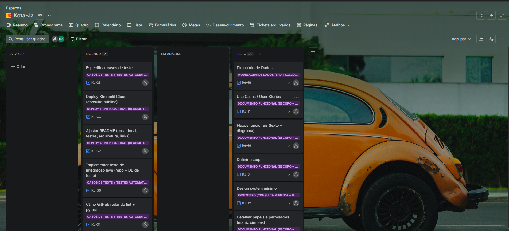

# Planejamento do Projeto

Este documento descreve como o trabalho foi planejado e rastreado no Jira (épicos, tarefas, status e critérios de entrega) para o projeto **KotaJá**.

[{ width="600" }](assets/jira.png){ .glightbox }
---

## 1. Visão geral do planejamento

O planejamento foi organizado em **épicos** (KJ-1 … KJ-7) com **subtarefas** associadas. A execução foi acompanhada por um **quadro Kanban**, permitindo visão clara de andamento, pendências e conclusão.

### Colunas / Status do fluxo
- **A FAZER**: item criado e priorizado, ainda não iniciado.
- **FAZENDO**: em desenvolvimento/execução.
- **EM ANÁLISE**: revisão, validação (ex.: revisar docs, checar prints, conferir deploy).
- **FEITO**: finalizado e validado.

---

## 2. Roadmap por épicos (alto nível)

### 2.1 KJ-1 — Documento Funcional (Escopo + Regras + Perfis)
Objetivo: consolidar requisitos e visão funcional (o que o sistema faz e para quem).

**Entregáveis esperados**
- Use Cases / User Stories
- Fluxos funcionais (texto + diagrama)
- Escopo do MVP (o que entra / o que fica fora)

---

### 2.2 KJ-2 — Protótipo (Consulta Pública + Backoffice conceitual)
Objetivo: prototipar telas e fluxo para validar UX e entendimento do produto.

**Entregáveis esperados**
- Protótipo Consulta Pública
- Protótipo Backoffice (conceitual)
- Evidências do protótipo (prints/links)

---

### 2.3 KJ-3 — Modelagem de Dados (ERD + Dicionário + Regras)
Objetivo: definir a base de dados do produto, com consistência e rastreabilidade.

**Entregáveis esperados**
- Entidades e relacionamentos
- ERD final
- Dicionário de dados
- Regras de integridade e índices recomendados

---

### 2.4 KJ-4 — TD (Technical Design) do Sistema
Objetivo: registrar decisões técnicas e arquitetura do MVP.

**Entregáveis esperados**
- Arquitetura (componentes e responsabilidades)
- Sequência/fluxo da consulta pública
- Design do batch (média mensal)
- Decisões técnicas

---

### 2.5 KJ-5 — Implementação: Consulta Pública (Streamlit)
Objetivo: implementar o MVP funcional da consulta pública.

**Entregáveis esperados**
- UI da consulta no Streamlit
- Service de cotação (consulta na tabela agregada mensal)
- Persistência de logs (tabela `public_quote_queries`)
- Ajuste de performance (cache listas marca/modelo)

---

### 2.6 KJ-6 — Casos de Teste + Testes Automatizados (Consulta Pública)
Objetivo: garantir qualidade por testes + CI.

**Entregáveis esperados**
- Especificação de casos de teste
- Testes unitários (service)
- Teste de integração leve (repo + DB de teste)
- CI no GitHub rodando lint + pytest

---

### 2.7 KJ-7 — Deploy + Entrega Final (README + links + evidências)
Objetivo: preparar entrega final com deploy, documentação e evidências.

**Entregáveis esperados**
- Deploy Streamlit Cloud (consulta pública)
- README final (como rodar, testes, arquitetura, links)
- Checklist final de evidências (prints/links)

---

## 3. Critérios de pronto (Definition of Done)

Um item pode ser movido para **FEITO** quando:
- Implementação concluída e revisada (quando aplicável)
- Evidência anexada (print/link/log)
- Para código: testes passando localmente e CI verde
- Para docs: link publicado no GitHub Pages e conferido no navegador

---
