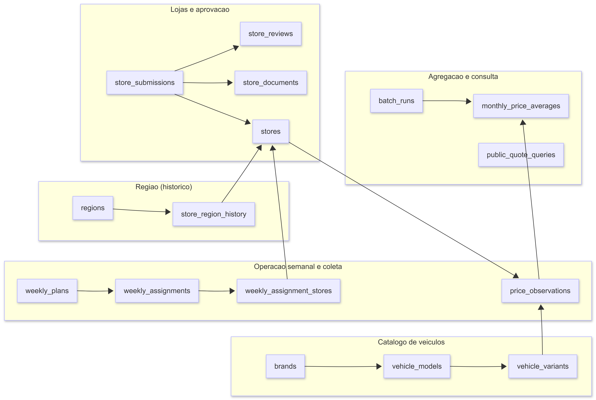

# Modelagem de Dados — Entidades e Regras

## 1. Objetivo
Definir as entidades do KotaJá, seus relacionamentos e regras mínimas de integridade, servindo de base para o ERD e o dicionário de dados.

---

## 2. Decisões 
- **A (Agregação mensal)**: média mensal por **variante + região**
- **B (Loja/região)**: loja pode mudar de região ao longo do tempo (**histórico**)
- **C (Observações)**: permitir múltiplas observações no mesmo dia (**com horário e/ou justificativa**)

---

## 1. Entidades

### Acesso e perfis (RBAC)
- **users**: usuários autenticados do backoffice (admin, gerente, coordenador, lojista, pesquisador)
- **regions**: regiões geográficas
- **user_regions**: vínculo usuário ↔ região (para coordenadores/pesquisadores)

### Catálogo de veículos
- **brands**
- **vehicle_models**
- **vehicle_variants**: (ex.: ano, versão, combustível)

### Lojas e aprovação
- **stores**: registro “oficial” da loja (ativo/inativo)
- **store_submissions**: submissão (lojista/pesquisador) para aprovação
- **store_documents**: metadados de documentos anexados
- **store_reviews**: decisão do coordenador (aprovar/rejeitar) + motivo + auditoria

### Região da loja (histórico)
- **store_region_history**: histórico de vínculo loja ↔ região com período de vigência

### Operação semanal e coleta
- **weekly_plans**: semana + região
- **weekly_assignments**: plano semanal + pesquisador
- **weekly_assignment_stores**: lojas atribuídas naquela semana
- **price_observations**: registros de preços observados (permitindo múltiplas no dia)

### Consulta pública e agregação
- **public_quote_queries**: log de consultas públicas (sem login)
- **monthly_price_averages**: resultado do batch (variante + região + mês)
- **batch_runs**: auditoria de execuções do batch

---

## 2. Relacionamentos (alto nível)
- brand 1:N vehicle_models
- vehicle_model 1:N vehicle_variants
- store 1:N store_submissions
- store_submissions 1:N store_documents
- store_submissions 1:N store_reviews
- store 1:N store_region_history
- region 1:N store_region_history (por vigência)
- region 1:N weekly_plans
- weekly_plan 1:N weekly_assignments
- weekly_assignment N:N stores (via weekly_assignment_stores)
- store 1:N price_observations
- vehicle_variant 1:N price_observations
- price_observations → alimenta monthly_price_averages
- public_quote_queries registra consultas e filtros aplicados

---

## 3. Regras mínimas de integridade
- Email de user é único
- Marca com nome único
- Modelo único por marca
- Variante única por modelo (modelo+ano+versão+combustível)
- Apenas loja **APROVADA/ATIVA** pode ser atribuída em planejamento semanal
- Observação deve referenciar loja + variante + pesquisador + datetime
- Permitir múltiplas observações no mesmo dia exige:
  - **datetime** obrigatório e
  - (opcional) campo de **fonte/nota**
- Batch mensal é idempotente por (**mês, variante, região**)
- Auditoria: entidades críticas registram `created_at`, `created_by` quando aplicável

---

## 4. Campos de localização
- `stores` deve incluir campos como cidade/UF (e opcionalmente bairro)
- Mesmo com média mensal por região, será possível futuramente analisar por cidade usando `stores`

{.glightbox}

