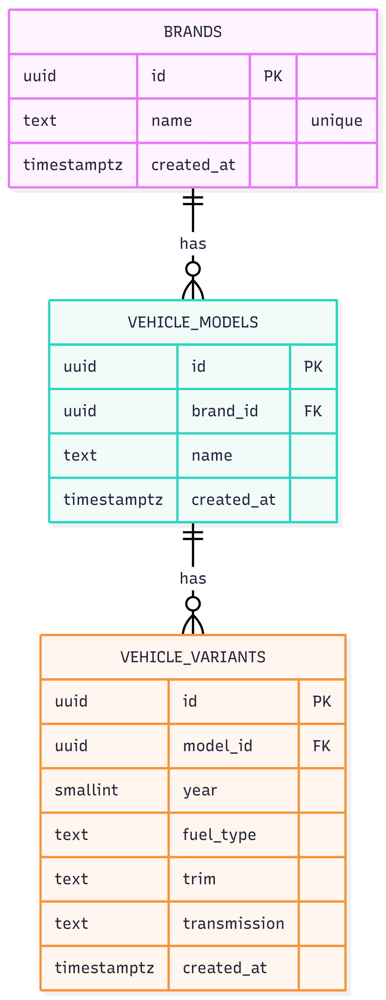
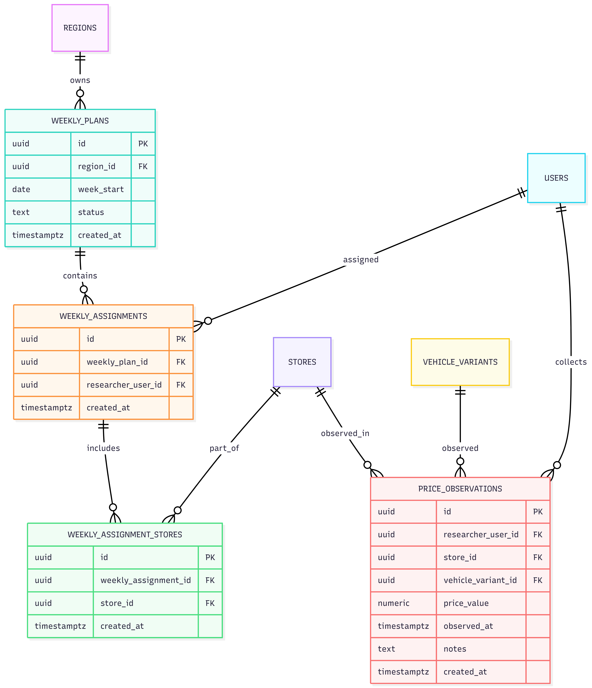
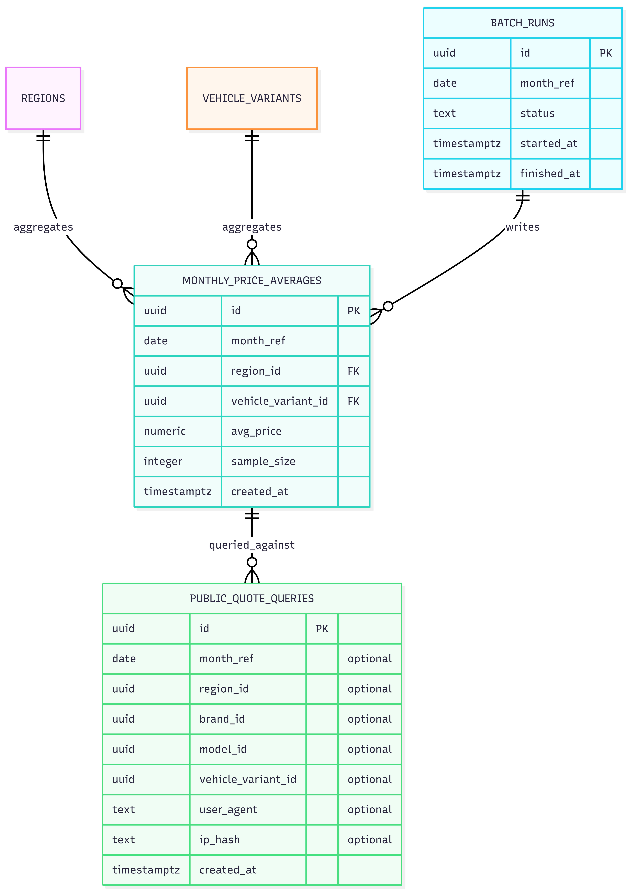

# ERD — Modelo Entidade-Relacionamento (PostgreSQL)

Este ERD está organizado em blocos.

> Observação: diagramas em alta resolução abrem em tela cheia (clique).

---

## 1. Catálogo de Veículos

[{ width="300" }](assets/diagrams/erd-01-catalogo.png){ .glightbox }

---

## 2. Lojas, Aprovação e Região (Histórico)

{.glightbox}

---

## 3. Planejamento Semanal e Coleta

{.glightbox}

---

## 4. Consulta Pública, Batch e Médias Mensais

{.glightbox}

---

## Regras-chave (integridade)
- **Média mensal** é calculada por **(mês, vehicle_variant_id, region_id)**.
- **Loja pode mudar de região**: `store_region_history` define vigência.
- **Observações múltiplas no dia**: `price_observations.observed_at` inclui data/hora.
- **Somente lojas aprovadas/ativas** podem entrar em `weekly_assignment_stores`.
- Logs de consulta pública são registrados em `public_quote_queries` (sem login).
