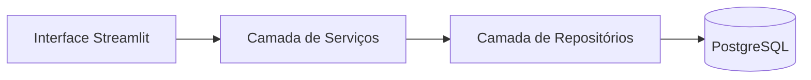

# Arquitetura de Alto Nível

## 1. Visão Geral

O KotaJá é uma aplicação web para captura, organização e consulta pública de preços de veículos.

O sistema segue arquitetura em camadas, priorizando simplicidade, rastreabilidade e separação de responsabilidades.

---

## 2. Tecnologias Principais

| Camada | Tecnologia |
|---------|------------|
| Interface | Streamlit |
| Backend lógico | Python |
| Persistência | PostgreSQL |
| Hospedagem app | Streamlit Cloud |
| Versionamento | GitHub |
| Documentação | MkDocs |

---

## 3. Camadas do Sistema

## 4. Responsabilidades por Camada

### Interface
- Renderiza telas
- Coleta filtros de consulta
- Exibe resultados

### Serviços
- Regras de negócio
- Orquestra fluxos
- Valida dados

### Repositórios
- Executa queries
- Isola acesso ao banco

### Banco de Dados
- Persistência
- Integridade
- Agregações batch

## 5. Integrações Externas
Atualmente o sistema não possui integrações externas obrigatórias.
Possíveis evoluções futuras:

- PIs públicas de referência de preços
- Serviços de autenticação
- Ferramentas analíticas

## 6. Princípios Arquiteturais
- Separação de responsabilidades
- Baixo acoplamento
- Alto grau de rastreabilidade
- Simplicidade operacional