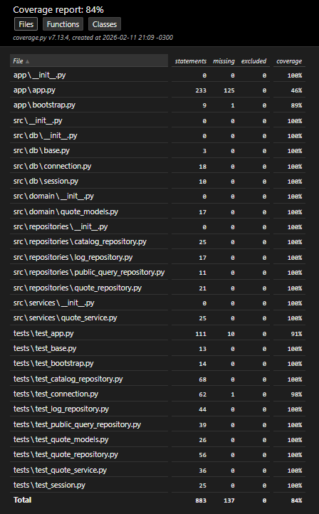

# Estratégia de Testes (MVP) — KotaJá

Este documento descreve a **estratégia**, o **escopo**, a **abordagem** e os **casos de teste** aplicados ao MVP do KotaJá, com foco no entregável atual: **Consulta Pública (média mensal por região e variante)**.

> **Objetivo:** garantir qualidade, estabilidade e rastreabilidade do MVP com testes automatizados, priorizando **core de domínio/serviço/repositórios**, e cobrindo a aplicação Streamlit com **smoke tests** e testes de **fluxos críticos** (sem depender do ambiente real).

---

## 1. Escopo de Teste

### 1.1 Incluído (nesta entrega / MVP)

#### Camada de Domínio

* **`QuoteFilters` / `QuoteResult`**

  * criação, defaults, imutabilidade (`frozen=True`), igualdade/hash

#### Camada de Serviço

* **`QuoteService.get_quote`**

  * retorno `None` quando não há resultado
  * conversão de tipos no payload retornado (ex.: `Decimal -> float`, `UUID -> str`)
  * garantia de **log** em sucesso e em “sem resultado”

#### Camada de Repositórios (SQL / acesso a dados)

* **`CatalogRepository`**

  * `list_regions`, `list_brands`, `list_models(brand_id)`, `list_variants(model_id)`
* **`QuoteRepository`**

  * `fetch_monthly_average(filters)` com parâmetros corretos (incluindo duplicação do variant_id por causa do `OR`)
  * `insert_public_query_log(...)` executa `INSERT` e `commit`
* **`LogRepository`**

  * `insert_public_query_log(...)` gera hash do IP (LGPD-friendly) e faz `commit`
  * `_hash_ip` com SHA-256
* **`PublicQueryRepository`**

  * `list_recent_enriched(limit)` executa query enriquecida (LEFT JOIN) e trata retorno vazio

#### Camada de Infra (DB)

* **`src/db/connection.py`**

  * carregamento do `.env` (quando existe)
  * validação de `DATABASE_URL`
  * `get_conn()` chama `psycopg.connect(...)` com `row_factory=dict_row`
* **`src/db/session.py`**

  * fallback para SQLite quando não há `DATABASE_URL`
  * engine sqlite com `check_same_thread=False`
  * engine não-sqlite com `connect_args={}`
  * `SessionLocal` como `sessionmaker`
* **`src/db/base.py`**

  * `Base` é `DeclarativeBase`, possui `metadata`, permite declarar modelos

#### Aplicação Streamlit (UI)

* **`app/bootstrap.py`**: smoke test do CSS injetado via `st.markdown`
* **`app/app.py`**:

  * **smoke test** garantindo que a aplicação “executa” sem quebrar
  * testes adicionais (quando aplicável) para cobrir fluxos sem dependência de DB real:

    * inicialização de filtros em `session_state`
    * caminhos de sucesso/erro no histórico
    * (opcional) simulação de clique em botões e branches de UI

> **Nota:** os testes de UI são **não-end-to-end**; são testes estruturais/funcionais usando **mock/fakes do Streamlit** para cobrir fluxos críticos sem depender do runtime do Streamlit nem do banco real.

---

### 1.2 Fora do escopo (próximas entregas)

* Login e área privada (**Admin/Backoffice**)
* RBAC e autorização por perfis
* Batch mensal automatizado (apenas design no MVP)
* Testes end-to-end (Playwright/Selenium) e testes reais de interface
* Observabilidade completa (métricas, tracing, etc.)

---

## 2. Abordagem e Princípios

### 2.1 Pirâmide de testes adotada

* **Unitários (principal):** regras de negócio e conversões do serviço
* **Unitários com mocks (repositories):** valida SQL/params/commit sem DB real
* **Smoke tests (Streamlit):** garante que o app executa e que estados críticos são criados

### 2.2 Isolamento e determinismo

* Testes não dependem de rede, DB externo, nem Streamlit runtime real.
* Acesso ao DB é isolado via mocks em `get_conn()`/`cursor()`.
* O script Streamlit é executado via `runpy.run_path` com um **fake do módulo `streamlit`**.

### 2.3 Riscos mitigados

* Quebras por refactor (assinatura de métodos, alteração de SQL, mudanças em params)
* Falhas silenciosas no log (não registrar consultas)
* Falhas de conversão (Decimal/UUID) na saída pública
* Regressões na inicialização do `session_state` do app

---

## 3. Tipos de Teste e Implementação

### 3.1 Testes Unitários (principal)

**Objetivo:** testar regras e fluxos do serviço sem DB real.

**Exemplos cobertos:**

* `QuoteService.get_quote` retorna `None` quando repo não acha linha
* `QuoteService.get_quote` converte `Decimal -> float` e `UUID -> str`
* logging é chamado em sucesso e em “sem resultado”

### 3.2 Testes de Repositório com mocks (unitários de SQL)

**Objetivo:** validar que:

* o SQL executado contém as cláusulas esperadas
* os parâmetros enviados são corretos
* quando aplicável, `conn.commit()` é chamado

> Esses testes não validam “se o SQL roda em Postgres real”; eles garantem que o contrato (query/params/commit) está correto.

### 3.3 Smoke Tests de Aplicação (Streamlit)

**Objetivo:** garantir que `app/app.py`:

* inicializa estado (`session_state`) corretamente
* renderiza sem exceptions (com dependências stubadas)
* cobre branches críticos (histórico vazio/erro, fallback de logo, etc.), quando ativado

---

## 4. Casos de Teste (MVP — Consulta Pública)

> **Legenda**

* **Camada alvo:** Service / Repository / App
* **Tipo:** Unit / Smoke
* **Isolamento:** Mock/Stubs (sem DB real)

---

### CT-01 — Consulta com resultado (Service)

**Dado** filtros válidos
**Quando** `fetch_monthly_average` retorna um registro
**Então**

* retorno é um `dict` com campos esperados
* `avg_price` (Decimal) é convertido para `float` quando aplicável
* `region_id` e `vehicle_variant_id` (UUID) são convertidos para `str` quando aplicável
* log é inserido (1x)

---

### CT-02 — Consulta sem resultado (Service)

**Dado** filtros válidos
**Quando** repo retorna `None`
**Então**

* retorno é `None`
* log é inserido (1x)

---

### CT-03 — Repositório de consulta executa SQL e params corretos (Repository)

**Dado** filtros válidos
**Quando** `fetch_monthly_average` é chamado
**Então**

* `cur.execute(sql, params)` recebe `month_ref`, `region_id` e `vehicle_variant_id` repetido 2x (por causa do OR)
* retorna `dict(row)` quando `fetchone()` existe
* retorna `None` quando `fetchone()` é `None`

---

### CT-04 — Repositório de log (LGPD) calcula hash e faz commit (Repository)

**Dado** IP informado
**Quando** `insert_public_query_log` é chamado
**Então**

* `ip_hash = sha256(ip)` é persistido
* `conn.commit()` é executado

**E quando** IP não é informado
**Então**

* `ip_hash` é `None`
* `conn.commit()` é executado

---

### CT-05 — Catálogo retorna listas e respeita parâmetros (Repository)

**Dado** um brand_id/model_id
**Quando** chamadas `list_models(brand_id)` e `list_variants(model_id)`
**Então**

* SQL contém `WHERE brand_id = %s` / `WHERE model_id = %s`
* params são tuplas com o UUID correto
* retorno é `List[Dict]`

---

### CT-06 — Histórico enriquecido retorna lista (Repository)

**Dado** `public_quote_queries` com joins
**Quando** `list_recent_enriched(limit)` é chamado
**Então**

* SQL contém `LEFT JOIN` necessários
* `LIMIT %s` usa parâmetro `limit`
* quando `fetchall()` é `None`, retorna lista vazia

---

### CT-07 — App “sobe” e inicializa filtros (Smoke)

**Dado** Streamlit fake + repos stubados
**Quando** o script `app/app.py` é executado
**Então**

* app não lança exception
* `st.session_state.filters` existe e tem `region_id`, `brand_id`, `model_id`, `vehicle_variant_id`

---

## 5. Critérios de Aceite (Qualidade)

* A camada `src/` deve permanecer com **alta cobertura** (objetivo ≥ 90% / ideal 100%)
* Fluxos principais (CT-01 a CT-06) devem ter testes automatizados
* Aplicação Streamlit deve possuir pelo menos um **smoke test** garantindo execução e estado inicial
* Cobertura deve ser gerada e revisada antes de release do MVP

---

## 6. Ferramentas e Execução

### 6.1 Ferramentas

* Test runner: **pytest**
* Cobertura: **coverage.py** (relatório no terminal e HTML)

### 6.2 Comandos (execução local)

Rodar testes:

```bash
pytest -q
```

Rodar cobertura focando em `src` e `app`:

```bash
python -m coverage run --source=src,app -m pytest
python -m coverage report -m
python -m coverage html
```

Abrir relatório HTML:

* arquivo gerado: `htmlcov/index.html`

---

## 7. Evidência de Cobertura

[](assets/coberturatest.png){.glightbox}

---

## 8. Observações 

### 8.1 Melhorias futuras

* Testes de integração com Postgres real (Docker) para validar SQL em runtime
* Testes end-to-end da UI (Playwright) simulando interação real
* Métricas/observabilidade para erros (Sentry/OTel)
* Refinar logging (ex.: registrar também `result_found` se for requisito)

---
