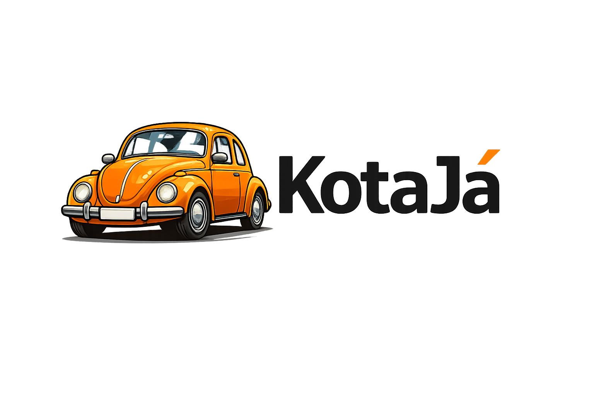

  

# KotaJá

Sistema de captura, organização e consulta pública de preços de veículos coletados em lojas físicas.

## Documentos
- [Planning](00-planning.md)
- [Visão e Escopo](01-visao-escopo.md)
- [Papéis e Responsabilidades](02-papeis-responsabilidades.md)
- [Fluxos Funcionais](03-fluxos-funcionais.md)
- [Requisitos](04-requisitos.md)
- [Modelagem de Entidades](05-modelagem-entidades.md)
- [ERD](06-erd.md)
- [Regras de Integridade e Índices](07-regras-integridade-indices.md)
- [Dicionário de Dados](08-dicionario-dados.md)
- [Modelo Físico (DDL)](09-modelo-fisico-ddl.md)
- [Notas de Modelagem](10-notas-modelagem.md)
- [Arquitetura em Alto Nível](11-arquitetura-alto-nivel.md)
- [Componentes](12-componentes.md)
- [Estrutura de Pastas](13-estrutura-pastas.md)
- [Fluxo Técnico da Consulta](14-fluxo-tecnico-consulta.md)
- [Contratos Services/Repos](15-contratos-services-repos.md)
- [Estratégia Técnica](16-estrategia-tecnica.md)
- [Decisões de Design](17-decisoes-design.md)
- [Estratégia de Testes](18-estrategia-testes.md)
- [Batch Design](19-batch-design.md)
- [Protótipos](20-prototipos.md)
